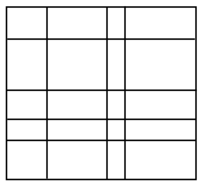
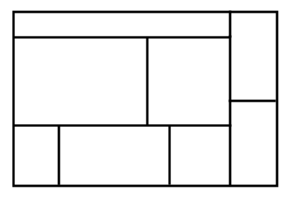
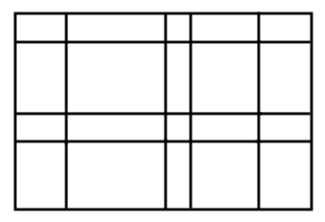

1. A **closed box** or just a **box** in $\mathbb{R}^d$ is a product $\prod_{i=1}^d [a_1^i, a_2^i]$$ of closed intervals.

2. Two boxes are said to be  **non-overlapping** if their interiors are disjoint.

3. For the next definition, let us say that an *$m$-partition** of $[a, b] \subseteq \mathbb{R}$ is a tuple $(a_1, \ldots, a_{m+1})$ such that $a = a_1$, $b = a_{m+1}$ and $a_i < a_{i+1}$ for all $1 \leq i \leq m$.

    A box $R = \prod_1^d I_k$ in $\mathbb{R}^d$ is said to be **gridded** by boxes $R_1, \ldots, R_N$ if the $R_i$'s are non-overlapping, if $R = \bigcup_1^N R_i$ and if there are $m_k$-partitions $p^k = (p_1^k, \ldots, p_{m_k + 1}^k)$ of each $I_k$ such that for each $R_a$ there are $i_1, \ldots, i_d$ with $1 \leq i_j \leq m_j$ for each $j$ such that

    $$R_a = \prod_1^d [p_{i_j}^j, p_{i_j + 1}^j]$$

    In other words, picture this, but in $d$-dimensions:

    

4. We want to define a *measure* on certain subsets of $\mathbb{R}^d$ which will give the "generalized volume" of the set (so length in $\mathbb{R}^1$, area in $\mathbb{R}^2$, volume in $\mathbb{R}^3$, and so on). Actually we will be giving a specific one called the **Lebesgue measure**. We denote the Lebesgue measure of a set $S$ by $\lambda(S)$. We proceed in steps, starting with:

    $$\lambda(\emptyset) = 0$$

    and

    $$\lambda(\prod_1^d [a_i, b_i]) = \prod_1^d (b_i - a_i)$$

5. If $R$ is a box gridded by $R_1, \ldots, R_N$, then

    $$\lambda(R) = \sum_1^N \lambda(R_i)$$

    *Proof:* Hand-waving here, but consider doing this one dimension at a time. If $R = \prod_1^d I_k$, then the partitions for $I_1, \ldots, I_{d-1}$ collectively form a partition for $\prod_1^{d-1} I_k$. So for each "column"

    $$[p_{i_1}^1, p_{i_1 + 1}^1] \times \cdots \times [p_{i_{d-1}}^{d-1}, p_{i_{d-1} + 1}^{d-1}] \times [a_d, b_d]$$

    the volume of this column is the sum of the boxes $R_i$ contained in that column because the in the $d$-th coordinate are a partition of $[a_d, b_d]$. Repeat this $d-1$ times and we have the result.

    TODO: Can we make this nicer and less hand-wavey via induction?

    (Also, I know this isn't a mathematical argument, but this fact should be "self-evident" and I feel a little silly taking this much effort to prove it. It's just hard because the notation for doing this in arbitrary dimensions is cumbersome).

6. Any box $R$ that is a union of finitely many non-overlapping boxes $R_1, \ldots, R_N$ has:

    $$\lambda(R) = \sum_1^N \lambda(R_i)$$

    *Proof:* For each $R_i = \prod_1^d [a_i, b_i]$ and every $j$ such that $1 \leq j \leq d$, for any other box $\prod_1^d [c_i, d_i]$ such that $a_j \in (c_j, d_j)$, partition it into two boxes with the $j$-th intervals being $[c_j, a_j]$ and $[a_j, d_j]$, respectively. Also do the same for $b_j$.

    In other words, do the following, but in $d$-dimensions. Turn

    

    into

    

    The result of doing this for every box $R_i$ is some collection of non-overlapping boxes $S_1, \ldots, S_M$ that make $R$ gridded, so by the previous proposition

    $$\lambda(R) = \sum_1^M \lambda(S_i)$$

    But each $R_i$ is gridded by some $S_j$'s by construction, so applying the previous proposition once again and rearranging we have the desired result (this is again handwavey, but it's probably not worth the time to make it more precise!).
