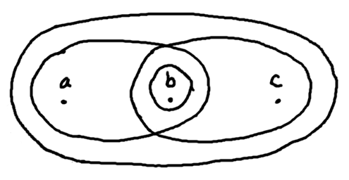

Related notes: [metric spaces](metric_spaces.html), [topology: bases and countability](topology_bases_countability.html)

1. A **topology** on any set $X$ is a collection $\mathcal{T}$ of subsets of $X$ that is closed under arbitrary union and finite intersection and contains both $\emptyset$ and $X$. The pair $(X, \mathcal{T})$ is said to be a **topological space**. (Usually we abuse terminology and say $X$ is a topological space with topology $\mathcal{T}$.) The sets in the topology are said to be the **open subsets** of $X$. A subset $U \subseteq X$ is said to be a **neighborhood** of $x \in X$ if both $x \in U$ and $U$ is open.

2. If you're trying to understand what the above definition of a topology *means*, stop trying and read what [Terry Tao has to say](http://mathoverflow.net/a/30231) about it:

     > Similarly, a topology is really a package of several different structures: the notion of openness, the notion of closedness, the notion of neighbourhoods, the notion of convergence, the notion of continuity, the notion of a homeomorphism, the notion of a homotopy, and so forth. They are all important, and it is somewhat artificial to try to designate one of them as being more "fundamental" than the other. But the notion of openness happens to generate all the other notions, and has a particularly elegant and simple axiomatisation, so we have elected to make it the basis for the standard minimalist definition of a topology. But it is important to realise that this is by no means the only way to define a topology, and adopting a more package-oriented point of view can be preferable in some cases (for instance, when generalising the notion of a topology to more abstract structures, such as topoi, in which open sets no longer are the most convenient foundation to begin with).

3. If $X$ is a set and $\mathcal{S}$ and $\mathcal{T}$ are topologies on $X$ such that every open set in $\mathcal{S}$ is an open set in $\mathcal{T}$, then $\mathcal{S}$ is said to be **coarser** than $\mathcal{T}$ (and $\mathcal{T}$ is **finer** than $\mathcal{S}$).

    The coarsest topology on any set $X$ is the **trivial topology** $\{ \emptyset, X\}$, while the finest topology, the power set of $X$, is called the **discrete topology**.

3. A point $x \in X$ is said to be an **interior point** of a subset $S \subseteq X$ precisely when there is a neighborhood $U$ of $x$ contained in $S$. Also, a point $x$ is said to be a **closure point** of $S$ when every neighborhood of $x$ intersects $S$. (Note that every $s \in S$ is a closure point of $S$, but there may be other closure points not in $S$. Not every $s \in S$ is an interior point, on the other hand, but all the interior points must be in $S$). The **interior** of a set $S$ is the collection of interior points, and the **closure** is the set of all closure points.

4. It is straightforward to prove that open subsets are precisely the sets that are equal to their interiors. Analogously to this, we can *define* **closed subsets** to be those sets that are equal to their closures.

5. It turns out that when you use the above definition, you can prove that a set is closed iff its complement is open. One can then prove, via DeMorgan's laws, that the collection of all closed sets is closed under arbitrary intersection, finite union, and contains both $\emptyset$ and $X$ (yes, $\emptyset$ and $X$ are simultaneously closed and open, a condition often called **clopen**).

6. Another characterization of closure and interior: interior of any set $S$ is the union of all open sets contained in $S$, while the closure of $S$ is the intersection of all closed sets that contain $S$. By these definitions, the interior is *the largest open set contained in $S$*, and the closure is *the smallest closed set containing $S$*.

7. A **boundary point** of a set is a point that is neither in the interior of the set, nor in the interior of the complement of the set. Equivalently, every neighborhood of a boundary point intersects both $S$ and $X - S$. The **boundary** of a set $S$ is the collection of all boundary points of $S$, sometimes denoted $\partial S$.

    By definition, boundary points are closure points, so closed sets contain all their boundary points. In fact, any closure point that isn't a boundary point is necessarily an interior point. In other words, the closure is the disjoint union of the interior and the boundary.

8. The boundary of any set is closed. The proof idea is that any closure point of the $\partial A$ must also be a boundary point of $A$. Let $b$ be such a point (a closure point of $\partial A$). Then every open neighborhood $U$ around $b$ intersects $\partial A$, so there's a point $x \in \partial A$. $x$ has some neighborhood $V$ contained in $U$ since $U$ is open, so $U$ intersects $A$ and $X - A$ since $V$ does. Since $U$ was arbitrary, we must have $b \in \partial A$.

9. The **exterior** of a set $S$ is defined to be $\text{int}(X - S)$. It can be proved that this is always identical to $X - \text{clo}(S)$.

    From this we have: given any set $S \subseteq X$, $X$ can always be partitioned into three disjoint sets:

     - the interior of $S$
     - the boundary of $S$
     - the exterior of $S$
    

10. An **accumulation point** of a set $S$ is some point $x \in X$ such that every neighborhood of $x$ intersects $S - x$. This definition is designed to exclude the **isolated points** of $S$, which are points $x$ in $S$ such that some neighborhood $U$ of $x$ contains no other point of $S$ other than $x$. 

11. Isolated points are by definition closure points, but they may either be interior points or boundary points depending on the set and the topology.

    In $\mathbb{R}^2$ under the Euclidean topology, the set $A = B(0; 1) \cup \{(5, 0)\}$ has $(5, 0)$ as an isolated point of $A$, and it is clearly a boundary point of $A$.

    Consider, on the other hand, any discrete space. Every subset is open (so all points in a set are interior points), but every point is an isolated point (singletons are open sets).

    TODO: can we find a single topology where one set has an isolated boundary point, and another set has an isolated interior point? What about a single set that has isolated boundary and isolated interior points?

12. Accumulation points are similarly closure points, but they may again either be interior points or boundary points.

    Take the example of $\mathbb{R}$ with the standard topology. Then the set $(-1, 1)$ has $1$ as an accumulation point that is a boundary point, and $0$ as an accumulation point that is an interior point.

13. (12) shows that accumulation points are not necessarily in the set, unlike isolated points. More generally, any boundary point of a set $A$ that is not contained in $A$ is necessarily an accumulation point. This means that a set without accumulation points must contain every boundary point, and so is closed.

14. Every closure point is either an isolated point or an accumulation point. If it's not in the set, it must be a boundary point and hence an accumulation point. If it's in the set, then it is either an accumulation point or an isolated point.

    This implies that the closure is the disjoint union of the isolated points and the accumulation points.

15. A subset $S$ of a topological space $X$ is **dense** in $X$ if its closure is $X$, and **nowhere dense** in $X$ if its interior is empty. Equivalently, $S$ is dense if every non-empty open subset of $X$ contains an element of $S$, and nowhere dense if every non-empty open subset of $X$ contains an element of $X - S$.

16. A **continuous map** is any function $f: X \to Y$ (where $X$ and $Y$ are topological spaces) such that every open $V \subseteq Y$ has $f^{pre}(V)$ open in $X$.

    If $f$ is bijective, continuous, with continuous inverse, it is called a **homeomorphism**. This is the notion of isomorphism for topological spaces.

17. There's a bunch of equivalent definitions for continuous maps. Here are three. Let $f: X \to Y$ be a map between topological spaces. Then $f$ is continuous exactly when either of these hold:

    1. For every $x \in X$ and any neighborhood $V$ of $f(x)$ in $Y$, there is a neighborhood $U$ of $x$ such that $f(U) \subseteq V$.
    2. $f^{pre}(C)$ is closed for every $C$ closed in $Y$
    3. For any $A \subseteq X$, $f$ maps closure points of $A$ to closure points of $f(A)$.

    If (1) is true, for any open $V$ in $Y$, either there is some $x \in X$ such that $f(x) \in V$, or $f^{pre}(V) = \emptyset$ and is hence open. In the former case by hypothesis there is some neighborhood of $x$ contained in $f^{pre}(V)$, so this set is open, proving $f$ is continuous. The converse is proved by noting that for every $x \in X$ and neighborhood $V$ of $f(x)$, $f^{pre}(V)$ is an open neighborhood of $x$ that works.

    For (2), note that $f^{pre}(Y - S) = X - f^{pre}(S)$ for any $S \subseteq Y$. So if preimages of open sets are all open, then so are preimages of closed sets, and vice versa.

    For (3), if $f$ is continuous and $A \subseteq X$, $\bar{f(A)}$ is closed in $Y$, so $f^{pre}(\bar{f(A)})$ is closed too (by what was just proved). Clearly $A \subseteq f^{pre}(\bar{f(A)})$, and since every closure point of a subset is a closure point of the whole set, $\bar{A} \subseteq f^{pre}(\bar{f(A)})$ (since the latter set is closed). So we have $f(\bar{A}) \subseteq \bar{f(A)}$, proving (3). Conversely, if (3) holds and $C$ is closed in $Y$, every closure point of $f^{pre}(C)$ gets mapped into a closure point of $f(f^{pre}(C)) = C$. $C$ being closed, this proves that $f^{pre}(C)$ contains its closure, so is closed.

18. It's actually improper to say that $f: X \to Y$ is a continuous map, since we have to specify topologies for $X$ and $Y$ as well. It's more accurate to say that $(f: X \to Y, \mathcal{T}, \mathcal{U})$ is a continuous map. Indeed, a given function $f: X \to Y$ can be continuous when $X$ is considered to have one topology, but not continuous when it has another. One way to see this has applications to coarseness of topologies:

    If $\mathcal{S}, \mathcal{T}$ are two topologies on $X$, then $\mathcal{S}$ is finer than $\mathcal{T}$ iff the identity on $X$ is continuous when the domain has topology $\mathcal{S}$ and the codomain has topology $\mathcal{T}$. (This follows immediately from the definition of continuity). Intuitively, if the codomain topology is finer, then the domain topology lacks the necessary "precision" needed for the output to be kept within any neighborhood in the codomain.

19. The composition of continuous maps is continuous: If $f: X \to Y$, $g: Y \to Z$ are continuous and $W$ is open in $Z$, then $g^{pre}(W)$ is open in $Y$, so $f^{pre}(g^{pre}(W))$ is open in $X$. But $f^{pre}(g^{pre}(S)) = (g \circ f)^{pre}(S)$ for all $S \subseteq Z$. A few simple examples of continuous maps are the **identity map** on any topological space, and any constant map (the pre-image of any set under a constant map is either the whole space or the empty set).

20. We can define the **convergence** of sequences in a topological space as follows: $(x_n)$ converges to $a \in  X$ when every neighborhood of $a$ contains all but finitely many terms of the sequence. This definition is not generally useful since limits are not unique in general topological spaces. For example, in the three-point space depicted by

    

    The constant sequence of $b$'s converges to both $a$ and $c$ (in addition to $b$) because every neighborhood around $a$ or $c$ contains the whole sequence.

    Even weirder, under the trivial topology every sequence converges to every point. So there are topological spaces where the concept of convergent sequences is nonsensical. (There are two notions for discussing convergence in general topological spaces: nets and filters. I haven't had a reason to care about them yet, so I don't know anything about them)

21. A sufficient (but not necessary) condition for ensuring uniqueness of limits is the **Hausdorff** property, which says that any two distinct points in a topological space have disjoint neighborhoods. Any space with this property is called a **Hausdorff space**. This ensures uniqueness of limits since two tail sequences of one sequence could not be contained in two disjoint sets (the smaller of the tail sequences would have to be contained in two disjoint sets, which is crazy talk).

    Another property of Hausdorff spaces is that all finite subsets are closed. To prove it, note that a singleton set $\{x\}$ must be closed because if there was a closure point $y \neq x$, then every neighborhood of $y$ would contain $x$, implying that the space is not Hausdorff. Since singletons are closed, finite unions of singletons are closed, so all finite subsets are closed.
